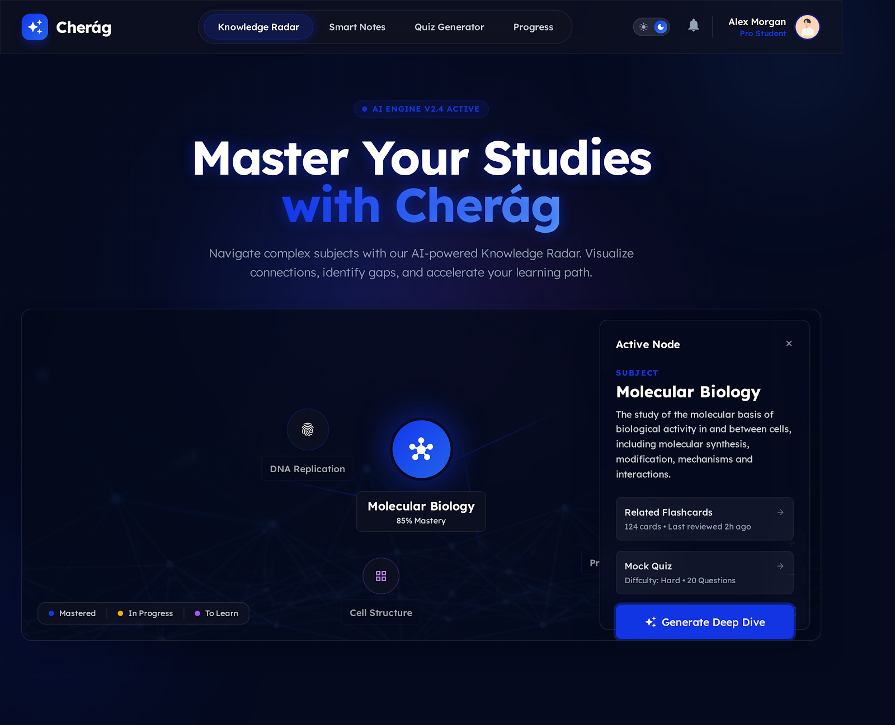
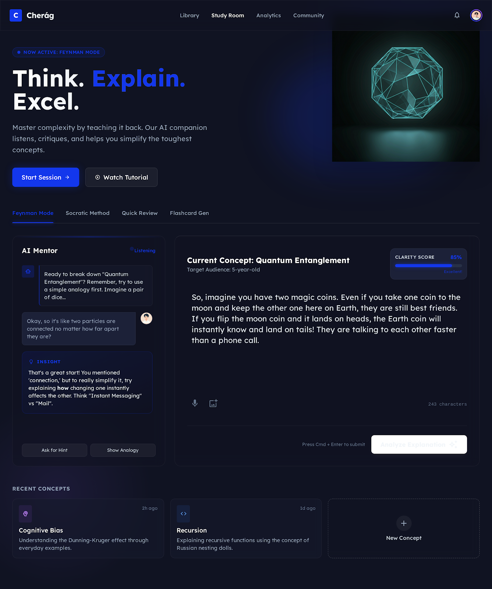

# 🌟 Cherág: The ADHD-Friendly Study Companion

**Cherág** is an AI-powered study platform designed to help neurodivergent students, particularly those with ADHD, overcome study paralysis and tackle long-form content. 

### The Problem
Traditional learning systems assume a linear, sustained attention span. For students with ADHD, large textbooks, multi-hour lecture videos, and static PDF documents are overwhelming. This leads to "study paralysis"—the inability to start studying because the barrier to entry feels impossibly high. 

### The Solution (And For Whom)
Cherág solves this by turning passive, long-form content into active, bite-sized, and highly interactive learning experiences. It breaks down dense syllabi into conversational chat, fast-paced quizzes, spaced-repetition flashcards, and algorithmically generated "Study Shorts" (TikTok-style educational videos). It is built for **students with ADHD**, high school/college students facing massive course loads, and anyone who struggles with standard, passive study methods.

---

## 🚀 Live Deployment
**Live URL:** [https://cherag.pages.dev](https://cherag.pages.dev) *(Fully functional, click to open!)*

*(Note: The backend is hosted live to support the frontend application. No local server is required to use the app at this URL).*

---

## 📸 Screenshots in Action

| Chat & RAG Interaction | Document Uploads & Parsing |
|:---:|:---:|
|  |  |

| Spaced Repetition Flashcards | AI-Generated Study Shorts |
|:---:|:---:|
|  |  |

---

## 🛠️ Features List

Everything Cherág can do, end-to-end:

**Core Learning Tools:**
- **RAG-Powered Chat**: Upload PDFs or DOCX files and instantly chat with them. The AI grounds its answers strictly in your uploaded syllabus.
- **Study Shorts**: Automatically curates short-form YouTube educational videos matching your exact syllabus topics to keep ADHD brains engaged without losing focus.
- **Auto-Generated Flashcards**: Extracts key terms and definitions from your documents into interactive flashcards.
- **Interactive Quizzes**: Generates dynamic multiple-choice quizzes to test your knowledge immediately after reading.
- **Session Memory**: The AI remembers your struggles, preferences, and progress across different study sessions (using a customized session summary engine).

**Premium Cognitive Features:**
- **Feynman Mode (Teach AI)**: Instead of the AI teaching you, *you* teach the AI. It acts as a skeptical 5th grader and grades your understanding.
- **Belief Graph**: A real-time cognitive model that tracks your misconceptions and correctly held beliefs, automatically propagating updates when you learn something new.
- **Concept Remix**: Merges two unrelated topics using the "Bridge Protocol" to force lateral thinking and deep neural connections.

---

## 🧠 The AI Feature & System Prompts

Cherág doesn't just use AI as a wrapper; it uses AI as a cognitive engine. 

### Feature: The Belief Graph & Session Memory
As the student interacts with the app (e.g., answering quizzes or teaching the AI in Feynman Mode), the AI runs a background cognitive extraction. It evaluates the student's answer, identifies underlying beliefs, and maps them as `correct`, `partially_correct`, or `misconception`. 

When a student starts a new session, the AI system prompt is dynamically injected with the student's unresolved misconceptions and previous session summaries, allowing the AI to organically course-correct the student.

### The Instructions (System Prompt)
*Here is the core system prompt used for the Belief Extraction Engine:*

```text
You are an expert cognitive psychologist and educational diagnostician.
Analyze the student's answer to the question.
Extract exactly ONE core belief or mental model the student is demonstrating.
State the belief as a declarative sentence from the student's perspective.
Evaluate if this belief is 'correct', 'partially_correct', or a 'misconception'.
Rate your confidence in this assessment from 0.0 to 1.0.

CRITICAL INSTRUCTION: If the student's answer is completely irrelevant to the question 
(e.g. they say "I don't know" or talk about video games), you MUST set "relevant": false. 
Do not hallucinate a belief.

Respond ONLY with valid JSON.
```

---

## ⚙️ Tools, Services, and AI Models

**Frontend:**
- **React 19 & Vite**: Lightning-fast UI framework.
- **Tailwind CSS (v4) & Framer Motion**: For modern, smooth, distraction-free aesthetics.
- **PDF.js & Tesseract.js**: For in-browser document parsing and OCR.

**Backend & Database:**
- **FastAPI (Python)**: High-performance async backend.
- **Supabase**: PostgreSQL database handling Auth, Row-Level Security (RLS), and `pgvector` for RAG embeddings.

**AI Models & Providers (Multi-Model Fallback Chain):**
1. **Google Gemini (2.5 Flash / Pro)**: Primary workhorse for fast generation.
2. **DeepSeek (deepseek-chat)**: Secondary fallback for complex reasoning.
3. **Groq (Llama-3.1-8b)**: Ultra-low latency fallback.
4. **Hugging Face (Llama-3.2-3B)**: Open-source serverless fallback.
5. **OpenRouter (Molmo-2-8b)**: Final fallback layer.

---

## 💻 How to Run the Project Locally

If you wish to run the full stack locally instead of using the live URL:

### 1. Clone the repository
```bash
git clone https://github.com/Qamber02/cherag.git
cd cherag
```

### 2. Backend Setup
```bash
# Create a virtual environment
python -m venv venv
source venv/bin/activate  # On Windows: venv\Scripts\activate

# Install dependencies
pip install -r requirements.txt

# Set up environment variables
# Create a .env file based on the required keys in config.py
# (GEMINI_API_KEY, SUPABASE_URL, SUPABASE_JWT_SECRET, etc.)

# Run the FastAPI server
uvicorn main:app --reload --port 8000
```

### 3. Frontend Setup
```bash
# Install dependencies
npm install

# Set up environment variables
# Create a .env file with VITE_SUPABASE_URL, VITE_SUPABASE_ANON_KEY

# Run the Vite development server
npm run dev
```

### 4. Access the App
Open your browser and navigate to `http://localhost:5173`.