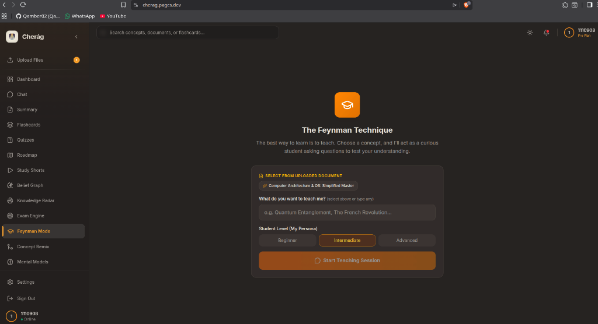
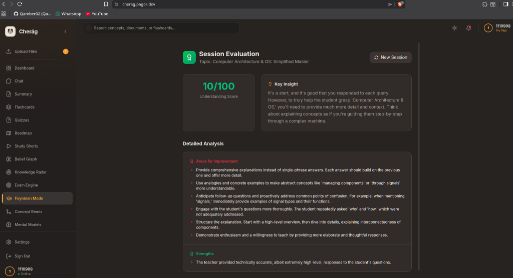
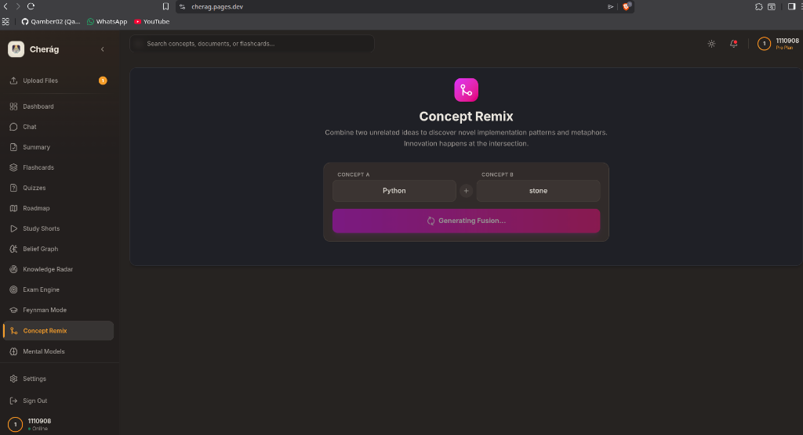
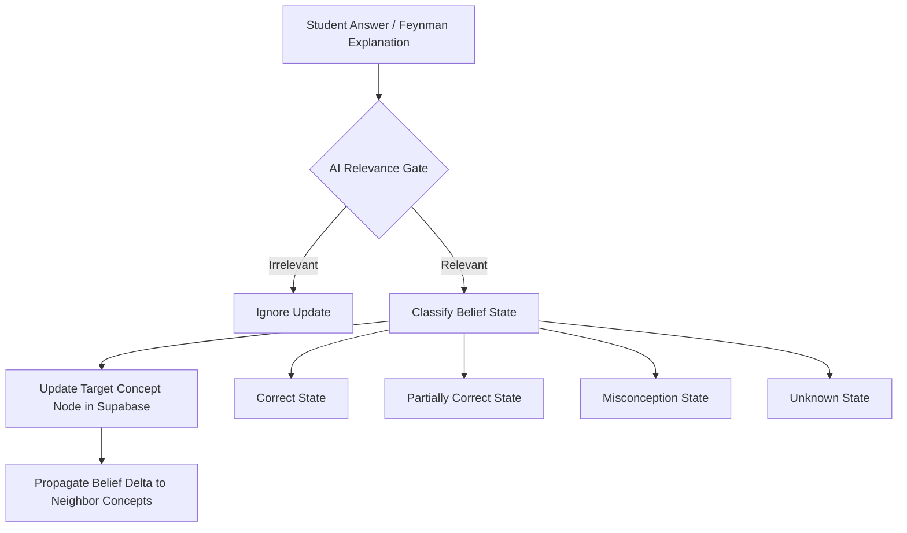
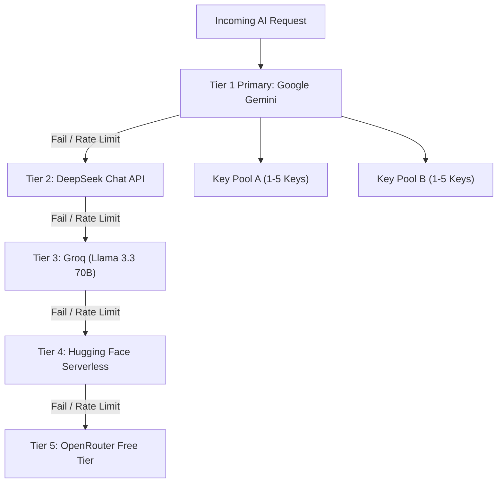
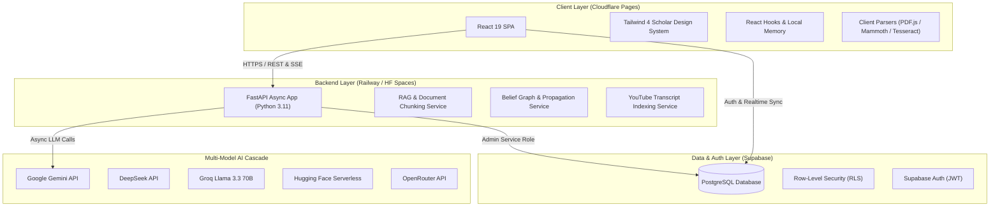

<h1 align="center">Cherág — The Cognitive AI Study Ecosystem</h1>

<p align="center">
  
</p>

<p align="center">
  <strong>Transforming static notes into active mastery with Cognitive Belief Graphs, Multi-Model AI Orchestration, and Adaptive Study Tools.</strong>
</p>

<p align="center">
  <a href="https://cherag.pages.dev"></a>
  <a href="https://huggingface.co/spaces/Qamber112/cherag-backend"></a>
  <a href="https://github.com/Qamber02/cherag"></a>
  <a href="https://github.com/Qamber02/cherag"></a>
  <a href="https://github.com/Qamber02/cherag"></a>
  <a href="https://github.com/Qamber02/cherag"></a>
</p>

---

## Live Deployment & Links

| Service | Access Link | Description |
|:---|:---|:---|
| **Production Web Application** | [cherag.pages.dev](https://cherag.pages.dev) | High-performance React 19 SPA hosted on Cloudflare Pages global CDN. |
| **Production FastAPI Backend** | Railway API Cluster | High-throughput async REST server orchestrating RAG, belief graphs & AI models. |
| **Hugging Face Spaces Mirror** | [huggingface.co/spaces/Qamber112/cherag-backend](https://huggingface.co/spaces/Qamber112/cherag-backend) | Dockerized backend container mirror with automatic health checks. |
| **Complete API Reference** | [docs/API_REFERENCE.md](docs/API_REFERENCE.md) | Full contract specifications for all frontend services and backend endpoints. |
| **Database Architecture** | [docs/DATABASE_DESIGN.md](docs/DATABASE_DESIGN.md) | Relational database schema, ER diagrams, and Row-Level Security policies. |
| **System Design Spec** | [docs/SYSTEM_DESIGN.md](docs/SYSTEM_DESIGN.md) | End-to-end multi-provider AI cascade architecture documentation. |

### Evaluator Demo Account

| Email | Password | Access Level |
|:---|:---|:---|
| `demo@cherag.com` | `DemoUser123!` | Pre-configured demo account with instant access to all study features, belief graphs, and mock exams. |

---

## Executive Summary & Creator's Journey

### The Cognitive Problem
According to cognitive science research (Dunlosky et al., 2013), **passive reading and highlighting are among the least effective study techniques**, leading to a false sense of mastery known as the *fluency illusion*. Students spend hours reading textbooks without testing their recall or identifying missing conceptual prerequisites. 

Existing ed-tech tools rely on static flashcard decks or generic chatbot summaries that lack context grounding, cognitive tracking, or deep diagnostic capabilities.

### The Cherág Solution
**Cherág** (Persian for *Illuminating Light*) is an end-to-end cognitive learning ecosystem. It ingests any study material (PDFs, DOCX, scanned notes, syllabus paste) and converts it into an active, multi-modal learning experience:

1. **Active Recall & Feynman Technique**: The student teaches concepts back to an AI that roleplays as a curious peer, evaluating the student's explanations for clarity, accuracy, and completeness.
2. **Cognitive Belief Graph Engine**: Instead of simply recording test scores, Cherág models *what the student actually believes* (correct, partially correct, misconception, unknown) and propagates belief updates across concept dependency networks.
3. **Multi-Model AI Resiliency**: Features a 5-tier fallback cascade across Google Gemini, DeepSeek, Groq Llama 3.3 70B, Hugging Face, and OpenRouter with API key rotation.
4. **Adaptive Personalization**: Uses spider-chart Knowledge Radars, timed Mock Exam Simulators with probability forecasting, and an infinite "Study Shorts" video feed powered by YouTube transcript indexing.

> Cherág was built from scratch as an individual project to bridge cutting-edge LLM orchestration with proven cognitive science principles.

---

## Comprehensive Visual Showcase

Cherág features a custom design system ("Scholar UI") built with Tailwind CSS 4, glassmorphism, dynamic dark/light modes, micro-animations via Framer Motion, and responsive layouts for desktop, tablet, and mobile.

### 1. Unified Dashboard & Activity Heatmap
Track active study streaks, daily learning targets, session history, and quick access to study modules.

<p align="center">
  
  <br /><em>Dashboard — Visualizing active study streaks, activity heatmaps, and active roadmaps.</em>
</p>

<p align="center">
  
  <br /><em>Detailed Analytics — Real-time performance tracking and session distribution metrics.</em>
</p>

---

### 2. Grounded RAG AI Chat & Source Citation
Chat with an AI tutor strictly constrained to your uploaded notes. Supports streaming SSE responses, exact page/excerpt citation, and concept verification.

<p align="center">
  
  <br /><em>RAG Chat — Context-grounded conversational Q&A with real-time source attribution.</em>
</p>

---

### 3. Cognitive Belief Graph & Knowledge Radar
Visualize your proficiency across sub-topics on an interactive spider chart. Identifies prerequisite gaps and generates micro-lessons to bridge weaknesses.

<p align="center">
  
  <br /><em>Knowledge Radar — Multi-dimensional proficiency mapping and concept deficit diagnosis.</em>
</p>

---

### 4. Feynman Technique ("Teach AI") Interactive Suite
The ultimate test of mastery. You explain a concept to the AI; the AI asks probing questions, detects confusion, grades your mental model, and switches to supportive teaching mode if needed.

<p align="center">
  
  <br /><em>Feynman Mode Setup — Selecting target concept and AI student curiosity level.</em>
</p>

<p align="center">
  
  <br /><em>Feynman Mode Dialogue — Interactive teaching session with real-time feedback.</em>
</p>

<p align="center">
  
  <br /><em>Feynman Evaluation — Diagnostic feedback on accuracy, completeness, and clarity scores.</em>
</p>

---

### 5. Timed Exam Simulation Engine & Readiness Prediction
Paste a syllabus or notes to build custom mock exams (MCQ, short answer, essay). Features timed exam pressure simulation, automated rubric grading, and passing probability prediction.

<p align="center">
  
  <br /><em>Exam Engine — Full-length mock exam simulation under timed test conditions.</em>
</p>

<p align="center">
  
  <br /><em>Readiness Prediction — Predictive scoring probability and weakness drill recommendations.</em>
</p>

---

### 6. Concept Remix & Mental Models Engine
Discover cross-domain analogies using lateral thinking (e.g., explaining Distributed Systems using Kitchen Operations) or apply famous frameworks (First Principles, Inversion, Pareto Principle).

<p align="center">
  
  <br /><em>Concept Remix Setup — Selecting cross-domain concepts for bridge building.</em>
</p>

<p align="center">
  
  <br /><em>Concept Remix Output — Synthesizing lateral connections between distinct disciplines.</em>
</p>

<p align="center">
  
  <br /><em>Mental Models — Deconstructing study material through 5 cognitive frameworks.</em>
</p>

---

### 7. Study Shorts — Video Feed for Learning
An infinite vertical video feed indexing relevant educational micro-videos via YouTube Transcript API. Tracks watch time, skips, and likes to continuously refine content relevance.

<p align="center">
  
  <br /><em>Study Shorts — Vertical video feed presenting topic-relevant short educational clips.</em>
</p>

---

## Complete Feature Matrix

| Feature Category | Feature Name | Core Mechanism | Technical Stack |
|:---|:---|:---|:---|
| **Core Ingestion** | **Document Parser** | Extracts text from PDF, DOCX, TXT, MD, and OCR scanned images. | PDF.js, Mammoth, Tesseract.js, PyMuPDF |
| | **RAG AI Chat** | Conversational Q&A grounded in uploaded document excerpts with exact line citations. | Gemini 2.5 Flash, SSE Streaming, Vector Store |
| | **Smart Summarizer** | Generates bullet point, academic, simple, or Cornell notes summaries with focus controls. | FastAPI, Async LLM Pipelines |
| | **AI Flashcard Suite** | Generates question/answer pairs with spaced repetition tracking and swipe gestures. | Framer Motion, Supabase PostgreSQL |
| | **Gamified Quizzes** | Infinite unique MCQs with difficulty selection, seed randomization, streak tracking & mistake review. | Dynamic Randomization Engine, Vitest |
| | **Mind Maps & Roadmaps** | Visual node graph auto-generated from document structure with drill-down node explanations. | React Flow / Canvas, Mermaid.js |
| **Cognitive Engine** | **Belief Graph Engine** | Models student mental state per concept (`correct`, `partially_correct`, `misconception`, `unknown`) with belief propagation. | Python Belief Service, Network Graphs |
| | **Feynman Mode (Teach AI)**| Student explains concepts to an AI roleplay student; receives accuracy, completeness & clarity diagnostic scores. | Adaptive Persona System Prompts |
| | **Knowledge Radar** | Spider chart visualization of proficiency across sub-topics with auto-generated micro-lessons. | Chart.js / SVG Canvas, Radar Analytics |
| **Advanced Tools** | **Exam Engine** | Mock exam generator for MCQs, short answers & essays with score probability prediction. | FastAPI Rubric Evaluator, Async Scoring |
| | **Concept Remix** | Lateral thinking engine generating cross-domain analogies between unrelated fields. | Multi-tier Prompt Orchestration |
| | **Mental Models** | Applies 5 thinking frameworks (First Principles, Second Order, Pareto 80/20, Inversion, Opportunity Cost). | Cognition Prompt Pipeline |
| | **Concept Compression** | Drills down dense chapters to absolute minimum viable knowledge required for exams. | Summarization Compression Heuristics |
| **Engagement & Utility**| **Study Shorts Feed** | Infinite vertical video feed powered by YouTube transcript extraction and interaction tracking. | YouTube Transcript API, Custom Player |
| | **Activity Dashboard** | Streak rings, heatmaps, session history logging, and learning profile DNA tracking. | Supabase RLS, Custom SVG Heatmaps |
| | **AI Model Selector** | Live toggle between Gemini 2.0/2.5, DeepSeek, Groq Llama 3.3, Hugging Face, and OpenRouter. | Multi-Provider Fallback Cascade |

---

## Deep Tech & AI Innovations

### 1. Cognitive Belief Graph & Propagation Engine

Standard study apps treat quizzes as simple numerical scores (e.g., 80%). Cherág implements a **Cognitive Belief Graph Engine** that maintains a dynamic model of what the student genuinely understands.



1. **Relevance Gating**: Evaluates whether input relates to target concept before updating state.
2. **State Classification**: Categorizes student comprehension into `correct`, `partially_correct`, `misconception`, or `unknown`.
3. **Graph Propagation**: Updates neighbor nodes in the conceptual dependency graph (e.g., if a student fails a quiz on *Backpropagation*, the belief node for *Gradient Descent* is updated with increased uncertainty).

---

### 2. Multi-Model AI Fallback Cascade (5 Tiers)

Cherág provides zero-downtime AI resilience by chaining 5 distinct AI inference providers. If an API key encounters rate limits (429) or service outages (5xx), the orchestration layer seamlessly cascades down to the next tier:



- **Key Rotation**: Each provider supports up to 5 environment API keys with randomized round-robin selection to maximize rate limits.
- **Provider-Agnostic Response Normalization**: All JSON outputs are validated using Zod (Frontend) and Pydantic (Backend) regardless of model quirks.

---

### 3. Hybrid Document Parsing Architecture

Cherág uses a dual-engine parsing pipeline:

- **Client-Side (Speed & Privacy)**:
  - `pdfjs-dist`: Extracts pure text from digital PDFs in the browser.
  - `mammoth.js`: Converts `.docx` files to HTML/Markdown.
  - `tesseract.js`: Browser-based WebAssembly OCR for scanned images.
- **Server-Side (Deep Text & Formats)**:
  - `PyMuPDF` (`fitz`): High-accuracy Python backend text and table extraction.

---

## Architecture & Database Design

### System Architecture Diagram

<p align="center">
  
  <br /><em>System Architecture — End-to-end component flow across React 19 SPA, FastAPI backend, Supabase BaaS, and multi-provider AI cascade.</em>
</p>



---

### Database Schema & Row-Level Security

Cherág relies on 9 relational PostgreSQL tables managed via Supabase migrations:

```
+-------------------+      +--------------------+      +--------------------+
|   belief_nodes    |      |    belief_edges    |      |   belief_history   |
+-------------------+      +--------------------+      +--------------------+
| id (UUID)         |<---->| id (UUID)          |      | id (UUID)          |
| user_id (FK)      |      | source_concept (FK)|      | node_id (FK)       |
| concept_label     |      | target_concept (FK)|      | previous_belief    |
| current_belief    |      | relationship_type  |      | new_belief         |
| confidence_score  |      +--------------------+      | updated_at         |
+-------------------+      +--------------------+      +--------------------+

+-------------------+      +--------------------+      +--------------------+
| knowledge_graphs  |      |  activity_history  |      |      quizzes       |
+-------------------+      +--------------------+      +--------------------+
| id (UUID)         |      | id (UUID)          |      | id (UUID)          |
| user_id (FK)      |      | user_id (FK)       |      | user_id (FK)       |
| document_id (FK)  |      | activity_type      |      | question           |
| graph_data (JSONB)|      | streak_count       |      | options (JSONB)    |
+-------------------+      +--------------------+      +--------------------+

+-------------------+      +--------------------+      +--------------------+
|    flashcards     |      | learning_profiles  |      | session_summaries  |
+-------------------+      +--------------------+      +--------------------+
| id (UUID)         |      | id (UUID)          |      | id (UUID)          |
| user_id (FK)      |      | user_id (FK)       |      | student_id (FK)    |
| front (Text)      |      | learning_style     |      | course_id (Text)   |
| back (Text)       |      | target_goals       |      | summary (Text)     |
+-------------------+      +--------------------+      +--------------------+
```

- **Row-Level Security (RLS)**: Enforces `auth.uid() = user_id` across all queries so users can only access their own study materials and belief state data.

---

## Core System Prompts

### 1. Belief Graph Cognitive Model Prompt
```text
You are a cognitive modeling engine, not a grader. Your job is to infer what
a student genuinely believes about a specific target concept based on their
answer, including incorrect or partially-formed beliefs.

Given:
- Target concept being evaluated: {concept_label}
- The student's previous belief (if any): {previous_belief}
- The student's new answer/input: {student_answer}

CRITICAL RELEVANCE RULE:
- If the student's answer is about a completely DIFFERENT or UNRELATED topic,
  set "relevant": false.

Return JSON:
{
  "relevant": true/false,
  "belief_statement": "what the student currently seems to think is true",
  "correctness": "correct | partially_correct | misconception | unknown",
  "confidence": 0.0-1.0,
  "changed_from_previous": true/false,
  "reasoning": "brief note on why you updated it this way"
}
```

### 2. Feynman Teaching Mode Prompt
```text
You are a {difficulty} student learning about "{concept}".
Your role:
- Be genuinely curious and engaged
- Ask probing questions that test the teacher's understanding
- Challenge with edge cases when appropriate
- Express confusion realistically when explanations are unclear

CRITICAL - HANDLING KNOWLEDGE GAPS:
If the teacher says "I don't know" or seems stuck:
1. STOP asking questions immediately.
2. Switch to supportive mode: explain the concept yourself using a simple analogy.
3. Ask a simple check-in question to get them back on track.
```

---

## Complete Technology Stack

| Domain | Technology / Library | Purpose / Usage |
|:---|:---|:---|
| **Frontend Core** | **React 19**, **TypeScript 5**, **Vite 5** | Core framework with strict type safety and fast HMR builds. |
| **Styling & Motion** | **Tailwind CSS 4**, **Framer Motion**, **Lucide React** | Custom Scholar UI design system, micro-animations, glassmorphism. |
| **Parsing (Browser)** | **PDF.js**, **Mammoth**, **Tesseract.js** | Client-side text and OCR extraction for PDF, DOCX, and images. |
| **Routing & Validation** | **React Router 7**, **Zod** | Client routing and runtime schema validation for API payloads. |
| **Backend Framework** | **FastAPI (Python 3.11)**, **Uvicorn**, **Pydantic v2** | High-performance async REST API and SSE streaming server. |
| **Parsing (Backend)** | **PyMuPDF (`fitz`)**, **pdfplumber** | High-precision server-side PDF text extraction. |
| **AI Providers** | **Google Gemini**, **DeepSeek**, **Groq**, **Hugging Face**, **OpenRouter** | 5-tier fallback LLM cascade for generation and reasoning. |
| **Database & Auth** | **Supabase (PostgreSQL)**, **Supabase Auth** | Relational BaaS with Row-Level Security and JWT authentication. |
| **Video Intelligence** | **YouTube Transcript API** | Indexing educational video clips and auto-generating transcripts. |
| **Hosting & CI/CD** | **Cloudflare Pages**, **Railway**, **Hugging Face Spaces**, **GitHub Actions** | Global CDN frontend deployment, containerized API hosting, CI pipelines. |
| **Testing** | **Vitest**, **React Testing Library**, **Pytest** | Comprehensive frontend unit/component tests and backend pytest suites. |

---

## API Reference Catalog

The FastAPI backend exposes 27 endpoints. Key routes include:

| Method | Endpoint Path | Description | Rate Limit Handling |
|:---|:---|:---|:---|
| `GET` | `/health` | Health check endpoint returning backend status & active models. | Standard Unthrottled |
| `POST` | `/generate-summary` | Generates summary with custom length, style, and focus area. | Token Bucket Throttled |
| `POST` | `/generate-flashcards` | Generates spaced repetition term/definition cards. | Token Bucket Throttled |
| `POST` | `/generate-quizzes` | Generates randomized multiple-choice quizzes. | Token Bucket Throttled |
| `POST` | `/generate-mindmap` | Generates hierarchical mind map JSON structures. | Token Bucket Throttled |
| `POST` | `/chat` | RAG-grounded SSE streaming conversational response. | Rate Limited per IP |
| `POST` | `/process-document` | Async document ingestion and chunk embedding pipeline. | Concurrency Throttled |
| `POST` | `/belief/update` | Updates student concept belief node and triggers propagation. | Rate Limited per Session |
| `POST` | `/premium/teaching/chat` | Feynman mode interactive roleplay response generation. | Rate Limited per IP |
| `POST` | `/premium/teaching/evaluate` | Evaluates Feynman session with accuracy, clarity & gap scores. | Token Bucket Throttled |
| `POST` | `/premium/exam/questions` | Generates custom syllabus mock exam questions. | Token Bucket Throttled |
| `POST` | `/premium/tools/remix` | Creates cross-domain lateral thinking analogies. | Token Bucket Throttled |

*For full request/response schemas, refer to [docs/API_REFERENCE.md](docs/API_REFERENCE.md).*

---

## Local Setup & Development

### Prerequisites
- **Node.js** >= 18 and **npm**
- **Python** 3.11+
- A free **Supabase** project
- At least one AI API key (Google Gemini recommended — [Get key here](https://aistudio.google.com/apikey))

### 1. Clone Repository
```bash
git clone https://github.com/Qamber02/cherag.git
cd cherag
```

### 2. Configure Environment Variables
Copy `.env.example` to `.env`:
```bash
cp .env.example .env
```
Fill in your credentials:
```env
# Frontend (Client Safe)
VITE_SUPABASE_URL=https://your-supabase-project.supabase.co
VITE_SUPABASE_ANON_KEY=your-supabase-anon-key
VITE_API_BASE_URL=http://localhost:8000

# Backend Secrets
SUPABASE_URL=https://your-supabase-project.supabase.co
SUPABASE_JWT_SECRET=your-supabase-jwt-secret
GEMINI_API_KEY=your-gemini-api-key
DEEPSEEK_API_KEY=your-deepseek-api-key
GROQ_API_KEY=your-groq-api-key
HUGGINGFACE_API_KEY=your-hf-api-key
OPENROUTER_API_KEY=your-openrouter-api-key
```

### 3. Start Backend API Server
```bash
# Install Python dependencies
pip install -r requirements.txt

# Start FastAPI server with live reload
uvicorn main:app --reload --port 8000
```

### 4. Start Frontend Application
```bash
# Install Node dependencies
npm install

# Start Vite dev server
npm run dev
```
Open [http://localhost:5173](http://localhost:5173) in your browser.

---

## Testing Suite Execution

Cherág includes automated test coverage for both frontend and backend logic.

### 1. Run Frontend Vitest Suite (15 Tests Passed)
```bash
npm test -- --run
```
```text
 PASSED: src/lib/beliefGraphService.test.ts (10 tests)
 PASSED: src/lib/validation.test.ts (4 tests)
 PASSED: src/components/Dashboard.test.tsx (1 test)

 Test Files  3 passed (3)
      Tests  15 passed (15)
```

### 2. Run Backend Pytest Suite (27 Tests Passed)
```bash
pytest tests/
```
```text
tests/test_belief_service.py ........                                    [ 29%]
tests/test_pdf_processor.py ......                                       [ 51%]
tests/test_rag_service_security.py ..                                    [ 59%]
tests/test_session_memory.py ...                                         [ 70%]
tests/test_video_service.py ........                                     [100%]
============================== 27 passed in 0.82s ==============================
```

---

## Repository File Architecture

```text
cherag/
├── src/                        # React Frontend (TypeScript)
│   ├── components/             # UI Components (16 feature tabs)
│   │   ├── premium/            # Advanced AI Tutors (Feynman, Radar, Exam, Remix)
│   │   ├── layout/             # Header, Sidebar, AppLayout
│   │   └── ...                 # Flashcards, Quizzes, Chat, Summary, Mindmap
│   ├── hooks/                  # Custom React Hooks (useFiles, useChat, useStudyShorts)
│   ├── lib/                    # API Clients, Parsers, Rate Limiter & Services
│   └── assets/                 # Icons & Static Media
├── services/                   # FastAPI Backend Microservices
│   ├── ai_utils.py             # 5-Tier LLM Fallback Cascade & Key Rotation Engine
│   ├── belief_service.py       # Cognitive Belief Graph & Propagation Engine
│   ├── rag_service.py          # Document Ingestion, Chunking & RAG Retrieval
│   ├── premium_service.py      # Feynman Mode, Exam Engine & Radar Analytics
│   ├── session_memory_service.py # Persistence Memory Manager
│   └── prompts.py              # Centralized AI System Prompts
├── tests/                      # Backend Pytest Suite (27 tests)
├── supabase/                   # Database Migrations (9 SQL Files) & RLS Policies
├── screenshots/                # Comprehensive Screenshot Gallery
├── docs/                       # Comprehensive Architecture & API Documentation
├── main.py                     # FastAPI Application Entry Point (27 routes)
├── config.py                   # System Configuration & Model Registry
├── Dockerfile                  # Container Spec for Hugging Face Spaces / Railway
└── package.json                # Frontend Dependencies & Build Scripts
```

---

## License & Attribution

This project was created by **Qamber Mohamed Hanif** as an individual final presentation project.  
All code, system architecture, prompt designs, and cognitive belief models are original work.

<div align="center">
  <br />
  <em>Built with precision, cognitive science, and AI to help students learn faster and deeper.</em>
</div>