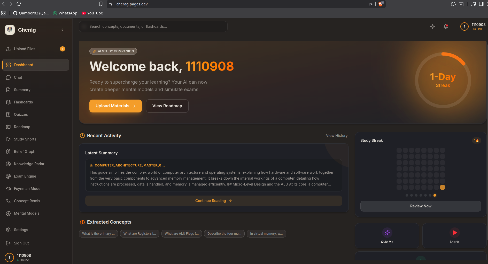
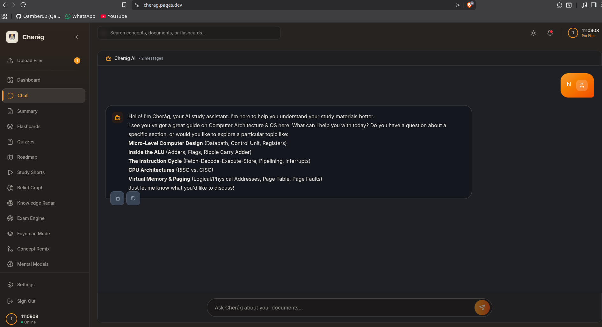
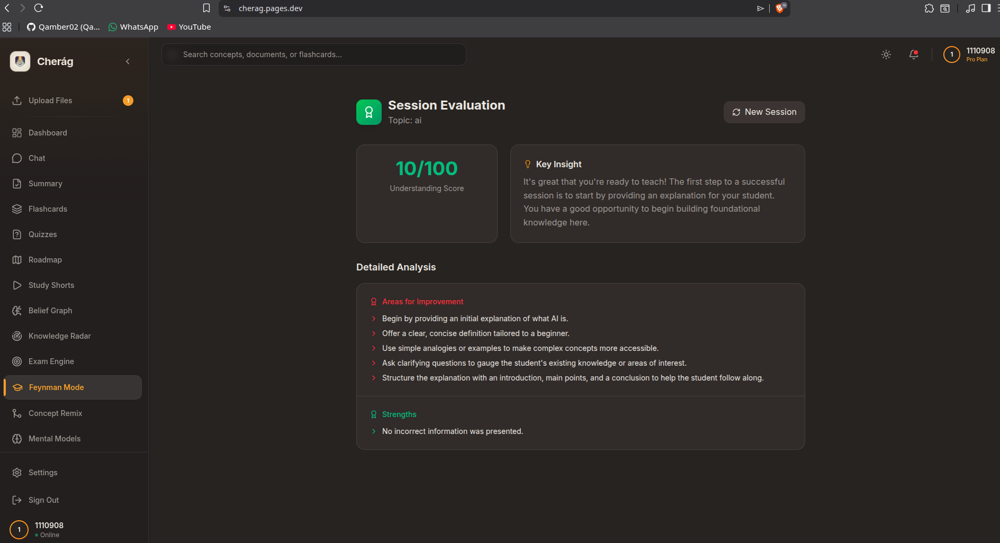
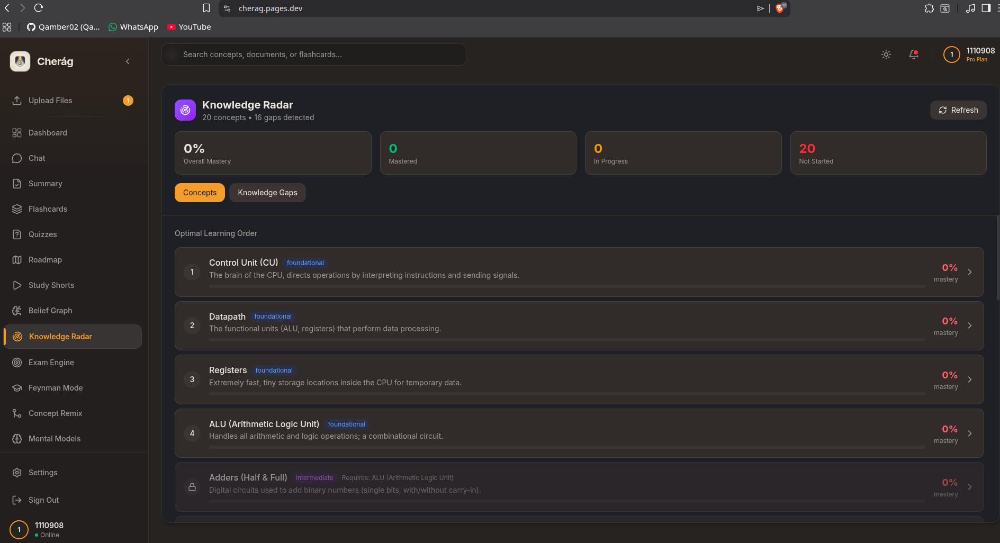
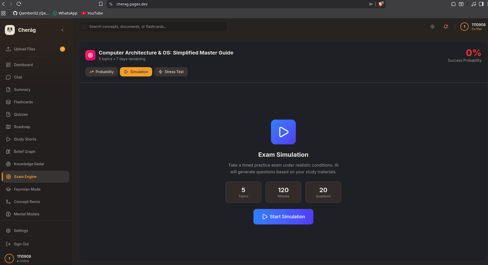
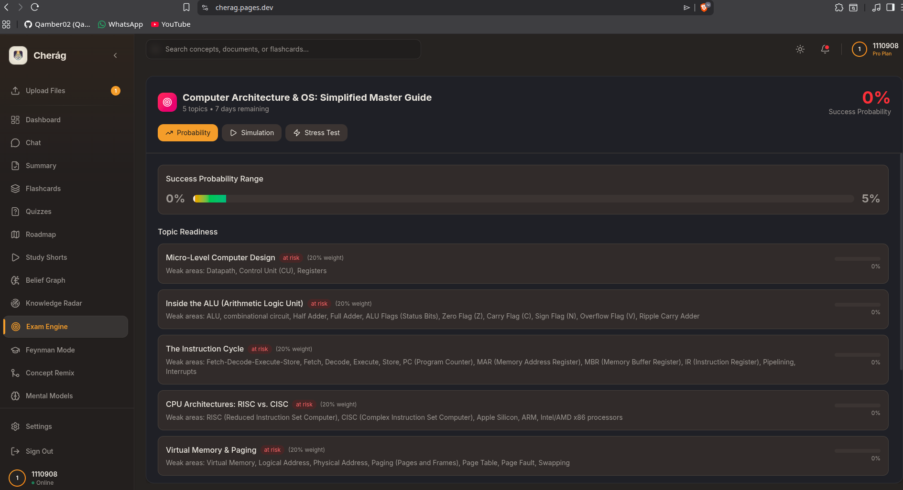
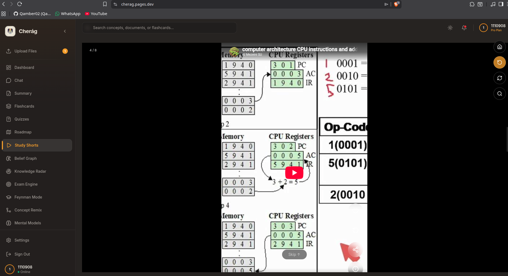

<h1 align="center">Cherág — AI-Powered Study Companion</h1>
<p align="center">
  <strong>Upload your notes. Let AI teach you.</strong><br />
  An end-to-end educational platform that transforms passive study materials into an active, personalized learning experience.
</p>
<p align="center">
  <a href="https://cherag.pages.dev"><strong>Live App → cherag.pages.dev</strong></a>
</p>

## The Problem
University students spend hours re-reading notes and textbooks — one of the _least_ effective study methods according to cognitive science research. They lack:
- **Active recall tools** tailored to _their specific_ material (not generic flashcard banks).
- **Knowledge gap visibility** — they don't know what they don't know until the exam.
- **A feedback loop** — no way to test understanding or get corrective feedback outside office hours.

**Cherág solves this** by turning any uploaded document (PDF, DOCX, or pasted text) into a full study toolkit — AI-generated quizzes, flashcards, summaries, mind maps, a belief graph that models _what the student actually understands_, and a Feynman-technique teaching mode where the AI plays a curious student asking follow-up questions.

**Who it's for:** University students preparing for exams — especially in technical subjects (CS, engineering, sciences) where conceptual understanding matters more than memorization.

---
<div align="center">
  <h1>Cherág</h1>
  <p><strong>The Ultimate AI Study Partner</strong></p>
  <p><em>Active Recall > Passive Reading</em></p>
</div>

## Screenshots

<p align="center">
  
  <br /><em>Dashboard — Track study streaks, session history, and active roadmap</em>
</p>
<p align="center">
  
  <br /><em>AI Chat — Ask questions grounded in your uploaded documents</em>
</p>
<p align="center">
  
  <br /><em>Mental Models — Apply cognitive frameworks like First Principles to your notes</em>
</p>
<p align="center">
  
  <br /><em>Concept Remix — Find hidden connections and analogies between unrelated topics</em>
</p>
<p align="center">
  
  <br /><em>Feynman Mode — Teach the AI and get evaluated on clarity and accuracy</em>
</p>
<p align="center">
  
  <br /><em>Knowledge Radar — Visualizes your proficiency across different sub-topics</em>
</p>
<p align="center">
  
  <br /><em>Exam Engine — Simulates full-length exams to prepare for real testing environments</em>
</p>
<p align="center">
  
  <br /><em>Exam Engine — Readiness probability prediction based on your performance</em>
</p>
<p align="center">
  
  <br /><em>Study Shorts — AI-curated TikTok-style learning videos tailored to your syllabus</em>
</p>

---

Cherág transforms static study materials (PDFs, Notes) into a dynamic, interactive learning ecosystem. It goes beyond simple summarization by acting as a proactive tutor—generating quizzes, curating educational video content, and challenging students to teach concepts back using the Feynman Technique. 

## Key Features

### Core Study Tools
| Feature | Description |
|---------|-------------|
| **Document Upload** | Upload PDF, DOCX, or paste text. Client-side parsing with PDF.js, Mammoth, and Tesseract.js OCR for scanned documents. |
| **AI Chat** | RAG-powered conversational Q&A grounded in your uploaded documents. Real-time streaming responses. |
| **Smart Summaries** | AI-generated summaries with configurable length, style (bullet points, paragraph, Cornell notes), and focus area. |
| **Flashcards** | Auto-generated question/answer flashcards from your material. Swipe-based review interface. |
| **AI Quizzes** | Multiple-choice quizzes with configurable difficulty (easy/medium/hard), question count, and topic. Includes gamification with answer streaks. |
| **Mind Map / Roadmap** | Visual learning roadmaps auto-generated from content. Click any node for an AI-generated deep-dive explanation. |

### Document Intelligence
*   **Smart Document Parsing:** Upload complex PDFs and documents. Context-aware vector embeddings allow the AI to deeply understand semantic meaning.
*   **Contextual Chat:** Ask specific questions grounded in your uploaded materials with source citations.
*   **Intelligent Summaries:** Generate concise summaries, key takeaways, and actionable items from dense chapters in one click.

### Premium AI Features
| Feature | Description |
|---------|-------------|
| **Belief Graph** | A cognitive model that tracks _what the student actually believes_ about each concept (correct, partially correct, misconception, unknown). Updates automatically from quiz answers and teaching sessions. Includes belief propagation to related concepts. |
| **Knowledge Radar** | Extracts concepts from content, maps prerequisites, identifies knowledge gaps, and generates interactive micro-lessons with quizzes to fill gaps. |
| **Feynman Mode (Teach AI)** | The student teaches a concept to the AI, which acts as a curious student. The AI asks probing questions ("What happens if...?", "How is this different from...?") and evaluates the session with scores for accuracy, clarity, and completeness. |
| **Exam Engine** | Paste a syllabus -> AI generates realistic mock exams (MCQ, short answer, essay) with timed simulation, rubric-based grading, and readiness probability prediction. |
| **Concept Remix** | Select two concepts and the AI finds hidden connections, cross-domain insights, and practical applications. |
| **Mental Models** | Apply thinking frameworks (First Principles, Second Order Thinking, Pareto Principle, Inversion, Opportunity Cost) to any study content. |
| **Activity Dashboard** | Study streak tracking, activity heatmap, session history, and quick-access stats. |
| **Study Shorts** | YouTube video clips extracted by AI into short, focused learning segments. |

### Interactive Learning Modes
*   **Gamified Quizzes:** Infinite, unique multiple-choice questions with a randomization engine to ensure you never see the exact same question twice. Includes a "Review Mistakes" session.
*   **AI Flashcards:** Automated generation of spaced-repetition term and definition cards.
*   **Study Shorts:** A "TikTok for Learning" interface featuring an infinite vertical scroll of educational short videos relevant to your document's topic.
*   **Mind Maps:** Visual node-based graphs to explore relationships between concepts and visualize the big picture hierarchy.

---

### Premium AI Tutors (Advanced Learning)
*   **Teach AI (Feynman Technique):** The AI acts as a beginner student. You explain the concept, and the AI grades your explanation for clarity and accuracy.
*   **Exam Engine:** Simulates full-length exams with mixed difficulty levels to prepare for real testing environments.
*   **Knowledge Radar:** Spider-chart visualization of your proficiency across different sub-topics.
*   **Concept Compression & Remix:** Applies the 80/20 rule to drill down to minimum viable knowledge, and generates analogies using lateral thinking.
*   **Mental Models:** Apply famous frameworks (e.g., First Principles, Inversion) to your study material.

## AI Feature — Deep Dive
Cherág uses AI across every feature. Here is the core system prompt architecture:

### Chat Assistant (RAG-based)
```text
You are Cherág, an AI study assistant. Answer the student's question based
ONLY on the following document excerpts.

DOCUMENT EXCERPTS:
{context}

STUDENT QUESTION: {query}

Provide a helpful, accurate answer. If the excerpts don't contain enough
information, say so.
```

### Belief Graph — Cognitive Modeling Engine
The most technically interesting AI feature. When a student answers a quiz or teaches a concept, the AI doesn't just grade it — it _models what the student believes_:
```text
You are a cognitive modeling engine, not a grader. Your job is to infer what
a student genuinely believes about a specific target concept based on their
answer, including incorrect or partially-formed beliefs.

Given:
- Target concept being evaluated: {concept_label}
- The student's previous belief (if any): {previous_belief}
- The student's new answer/input: {student_answer}

CRITICAL RELEVANCE RULE:
- If the student's answer is about a completely DIFFERENT or UNRELATED topic,
  set "relevant": false.

Return JSON:
{
  "relevant": true/false,
  "belief_statement": "what the student currently seems to think is true",
  "correctness": "correct | partially_correct | misconception | unknown",
  "confidence": 0.0-1.0,
  "changed_from_previous": true/false,
  "reasoning": "brief note on why you updated it this way"
}
```
When a belief updates, it **propagates to neighboring concepts** in the graph via a second AI call, simulating how understanding one concept affects related ones.

### Feynman Teaching Mode
```text
You are a {difficulty} student learning about "{concept}".
Your role:
- Be genuinely curious and engaged
- Ask probing questions that test the teacher's understanding
- Challenge with edge cases when appropriate
- Express confusion realistically when explanations are unclear

CRITICAL - HANDLING KNOWLEDGE GAPS:
If the teacher says "I don't know" or seems stuck:
1. STOP asking questions immediately.
2. Switch to supportive mode: explain the concept yourself using a simple analogy.
3. Ask a simple check-in question to get them back on track.

Question types:
1. "Could you explain why...?" (tests depth)
2. "What happens if...?" (tests edge cases)
3. "How is this different from...?" (tests distinctions)
4. "Can you give me an example?" (tests application)
```

### Multi-Model AI Fallback Chain
The backend uses a **4-tier fallback cascade** with automatic key rotation:
```text
Gemini (2.0 Flash Lite -> 2.0 Flash -> 2.5 Flash -> 2.5 Pro)
  | fallback
DeepSeek Chat
  | fallback
Groq (Llama 3.3 70B at 280 tokens/sec)
  | fallback
Hugging Face (Llama-3.2-3B)
  | fallback
OpenRouter (Molmo 2-8B free tier)
```
Each provider supports up to 5 API keys with random rotation to avoid rate limits. Users can also manually select a specific model from the Settings page.

---

## Tech Stack

### Frontend
| Technology | Purpose |
|------------|---------|
| **React 19** + **TypeScript** | UI framework with strict type safety |
| **Vite 5** | Build tool and dev server |
| **Tailwind CSS 4** | Utility-first styling with dark/light mode |
| **Framer Motion** | Animations and transitions |
| **Supabase JS** | Client-side auth and real-time database |
| **PDF.js** + **Mammoth** + **Tesseract.js** | Client-side document parsing (PDF, DOCX, OCR) |
| **React Router 7** | Client-side routing |
| **Zod** | Runtime schema validation |
| **Vitest** + **Testing Library** | Unit and component testing |

### Backend
| Technology | Purpose |
|------------|---------|
| **FastAPI** (Python 3.11) | REST API server with async support |
| **Supabase** (PostgreSQL) | Database, auth, and row-level security |
| **Google Gemini API** | Primary AI model (multi-model rotation) |
| **Groq API** | Fast inference fallback (Llama 3.3 70B) |
| **DeepSeek API** | Secondary AI fallback |
| **Hugging Face Serverless** | Tertiary open-source fallback |
| **OpenRouter API** | Final fallback (free tier) |
| **PyMuPDF** | Server-side PDF text extraction |
| **YouTube Transcript API** | Study Shorts video clip extraction |

### Infrastructure
| Service | Purpose |
|---------|---------|
| **Cloudflare Pages** | Frontend hosting (global CDN) |
| **Railway** | Backend hosting (FastAPI) |
| **Hugging Face Spaces** | Backend mirror (Docker) |
| **Supabase Cloud** | Managed PostgreSQL + Auth |
| **GitHub Actions** | CI/CD pipelines |

---

## Architecture
*   **Frontend:** React (v19) + Vite + TypeScript. Lightning-fast load times with a custom TailwindCSS "Scholar" design system featuring Glassmorphism and robust Dark Mode support. Deployed on **Cloudflare Pages**.
*   **Backend:** Python FastAPI. Server-side AI orchestration with secure API key management, rate-limit handling, and multi-model fallback. Deployed on **Hugging Face Spaces**.
*   **Database:** Supabase (PostgreSQL + Auth) for relational data and robust Vector Store capabilities.
*   **AI Logic:** Hybrid LLM usage with automatic failover protection (if one API errors out, the system seamlessly retries with another).

```text
[React Frontend] <---- HTTPS ----> [FastAPI Backend]
(Cloudflare Pages)     <-- SSE ---     (Railway)
        |                                  |
   Supabase JS                        Supabase Admin
        |                                  |
        v                                  v
[          Supabase Cloud (PostgreSQL, Auth, RLS, Storage)          ]
                                           |
                    +----------------------+----------------------+
                    v                      v                      v
                [Gemini]                [Groq]               [DeepSeek]
```

## Database Schema
8 migration files define the schema:

| Table | Purpose |
|-------|---------|
| `belief_nodes` | Current belief state per student x concept |
| `belief_edges` | Concept dependency relationships |
| `belief_history` | Timestamped belief change log |
| `knowledge_graphs` | Extracted concept maps per document |
| `activity_history` | Study session logs for streak tracking |
| `quizzes` | Generated quiz questions and user answers |
| `flashcards` | Generated flashcard decks |
| `learning_profiles` | User preferences and learning DNA |
| `session_summaries` | Stores AI-generated session context memory |

All tables use Row-Level Security (RLS) — students can only access their own data.

---

## How to Run Locally

### Prerequisites
- **Node.js** >= 18 and **npm**
- **Python** 3.11+
- A [Supabase](https://supabase.com) project (free tier works)
- At least one AI API key (Gemini recommended — [get one free](https://aistudio.google.com/apikey))

### 1. Clone the repository
```bash
git clone https://github.com/Qamber02/cherag.git
cd cherag
```

### 2. Set up environment variables
Copy the example file and fill in your keys:
```bash
cp .env.example .env
```

Required variables:
```env
# Frontend (safe to expose)
VITE_SUPABASE_URL=your_supabase_url
VITE_SUPABASE_ANON_KEY=your_supabase_anon_key
VITE_API_BASE_URL=http://localhost:8000

# Backend (secret)
SUPABASE_URL=your_supabase_url
SUPABASE_JWT_SECRET=your_supabase_jwt_secret
GEMINI_API_KEY=your_gemini_api_key
OPENROUTER_API_KEY=your_openrouter_api_key
HUGGINGFACE_API_KEY=your_hf_api_key
```

### 3. Start the backend
```bash
# Install Python dependencies
pip install -r requirements.txt
# Start the FastAPI server
uvicorn main:app --reload --port 8000
```

### 4. Start the frontend
```bash
npm install
npm run dev
```
The app will be available at `http://localhost:5173`.

### 5. Run tests
```bash
# Frontend tests
npm test
# Backend tests
pytest tests/
```

---

## Repository Structure
```text
cherag/
|-- src/                    # React frontend
|   |-- components/         # UI components (16 tabs + layout)
|   |   |-- premium/        # Advanced AI features (7 components)
|   |   |-- layout/         # Sidebar, Header, AppLayout
|   |   `-- ...             # Core tabs (Chat, Quiz, Flashcards, etc.)
|   |-- hooks/              # Custom React hooks
|   |-- lib/                # Services, API clients, utilities
|   `-- assets/             # Static assets
|-- services/               # Python backend services
|   |-- ai_utils.py         # Multi-model AI fallback engine
|   |-- belief_service.py   # Cognitive belief graph engine
|   |-- premium_service.py  # Premium feature orchestration
|   |-- rag_service.py      # Document processing + RAG
|   |-- prompts.py          # Core AI prompt templates
|   |-- session_memory_service.py # Context persistence
|   `-- premium_prompts.py  # Advanced AI prompt templates
|-- tests/                  # Backend unit tests
|-- supabase/migrations/    # Database schema (9 migrations)
|-- main.py                 # FastAPI application entry point
|-- config.py               # Environment config + model catalogue
|-- Dockerfile              # HF Spaces deployment
`-- docs/                   # Architecture diagrams + documentation
```

---

## License
This project is proprietary and confidential.

<div align="center">
  <em>Built with love for students who want to learn faster and better.</em>
</div>

This project was built as an individual final project. All code is original work.

---
<p align="center">
  Built with AI by <strong>Qamber Mohamed Hanif</strong>
</p>