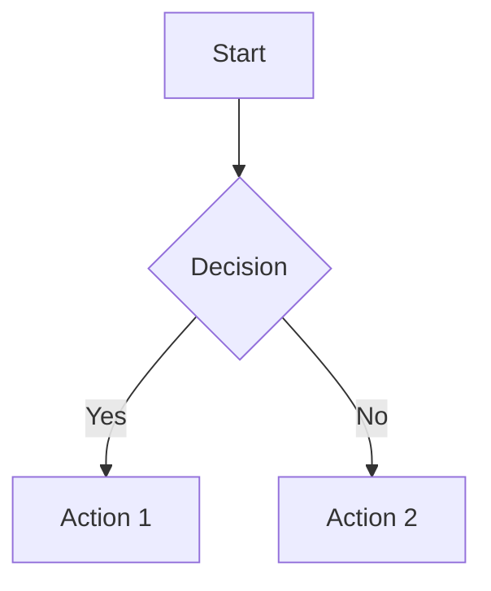

# Cherág - API Reference Guide

## Overview

This document provides a comprehensive reference for all APIs, hooks, and services available in the Cherág application.

---

## Table of Contents

1. [Custom React Hooks](#1-custom-react-hooks)
2. [AI Service Functions](#2-ai-service-functions)
3. [Utility Services](#3-utility-services)
4. [Supabase Database API](#4-supabase-database-api)
5. [External API Integrations](#5-external-api-integrations)

---

## 1. Custom React Hooks

### 1.1 useFiles

**Purpose**: Manages document upload, parsing, and deletion.

**Location**: `src/hooks/useFiles.ts`

```typescript
interface Document {
  id: string;
  filename: string;
  file_type: string;
  content: string;
  created_at: string;
}

function useFiles(user: User): {
  files: Document[];
  isParsing: boolean;
  uploadFile: (file: File) => Promise<void>;
  removeFile: (id: string) => Promise<void>;
}
```

**Usage Example**:
```typescript
const { files, isParsing, uploadFile, removeFile } = useFiles(session.user);

// Upload a file
await uploadFile(selectedFile);

// Remove a file
await removeFile(fileId);
```

---

### 1.2 useChat

**Purpose**: Manages chat messages with AI assistant.

**Location**: `src/hooks/useChat.ts`

```typescript
interface Message {
  id?: string;
  role: 'user' | 'assistant';
  content: string;
}

function useChat(user: User): {
  messages: Message[];
  sendMessage: (content: string, context: string) => Promise<void>;
  isLoading: boolean;
}
```

**Usage Example**:
```typescript
const { messages, sendMessage, isLoading } = useChat(session.user);

// Send a message
await sendMessage("What is the main concept?", documentContext);
```

---

### 1.3 useFlashcards

**Purpose**: Manages flashcard generation and persistence.

**Location**: `src/hooks/useFlashcards.ts`

```typescript
interface Flashcard {
  id?: string;
  question: string;
  answer: string;
}

function useFlashcards(userId: string): {
  flashcards: Flashcard[];
  isLoading: boolean;
  generateFlashcards: (context: string) => Promise<void>;
  clearFlashcards: () => Promise<void>;
}
```

---

### 1.4 useStudyShorts

**Purpose**: Manages YouTube video search and recommendations.

**Location**: `src/hooks/useStudyShorts.ts`

```typescript
interface Video {
  id: string;
  title: string;
  thumbnail: string;
  channel?: string;
  relevanceScore?: number;
}

function useStudyShorts(): {
  videos: Video[];
  isLoading: boolean;
  searchVideos: (topic: string) => Promise<void>;
  loadMore: () => Promise<void>;
  nextPageToken: string | null;
}
```

---

## 2. AI Service Functions

### 2.1 Main AI Service

**Location**: `src/lib/aiService.ts`

#### generateSummary

```typescript
function generateSummary(
  context: string, 
  options?: { 
    length?: 'short' | 'medium' | 'long';
    style?: 'academic' | 'simple' | 'bullet';
    focus?: string;
  }
): Promise<string>
```

**Parameters**:
| Parameter | Type | Required | Description |
|-----------|------|----------|-------------|
| context | string | Yes | Document text to summarize |
| options.length | string | No | Summary length preference |
| options.style | string | No | Formatting style |
| options.focus | string | No | Specific focus area |

**Returns**: Markdown-formatted summary string

---

#### generateFlashcards

```typescript
function generateFlashcards(
  context: string
): Promise<Array<{ question: string; answer: string }>>
```

**Parameters**:
| Parameter | Type | Required | Description |
|-----------|------|----------|-------------|
| context | string | Yes | Document text for flashcard generation |

**Returns**: Array of question-answer pairs (typically 5 cards)

**Example Response**:
```json
[
  { "question": "What is photosynthesis?", "answer": "The process by which plants convert light energy into chemical energy." },
  { "question": "Where does photosynthesis occur?", "answer": "In the chloroplasts of plant cells." }
]
```

---

#### generateQuizzes

```typescript
interface Quiz {
  question: string;
  options: string[];
  correct_answer: string;  // Letter: 'A', 'B', 'C', or 'D'
  explanation: string;
}

function generateQuizzes(context: string): Promise<Quiz[]>
```

**Returns**: Array of multiple-choice questions (typically 5 questions)

---

#### generateDiagram

```typescript
function generateDiagram(context: string): Promise<string>
```

**Returns**: Mermaid.js flowchart syntax string

**Example Response**:


---

#### generateMindMap

```typescript
interface MindMapNode {
  title: string;
  children: MindMapNode[];
}

function generateMindMap(context: string): Promise<MindMapNode>
```

**Returns**: Hierarchical mind map structure (max 3 levels deep)

---

#### chatWithAI

```typescript
function chatWithAI(context: string, query: string): Promise<string>
```

**Parameters**:
| Parameter | Type | Description |
|-----------|------|-------------|
| context | string | Document context for grounding responses |
| query | string | User's question |

**Returns**: AI-generated response string

---

#### generateVideos

```typescript
interface VideoResult {
  id: string;
  title: string;
  thumbnail: string;
  channel?: string;
  relevanceScore?: number;
}

function generateVideos(
  topic: string, 
  pageToken?: string | null
): Promise<{ result: VideoResult[]; nextPageToken: string | null }>
```

**Parameters**:
| Parameter | Type | Description |
|-----------|------|-------------|
| topic | string | Search topic |
| pageToken | string | Pagination token for next page |

---

### 2.2 Gemini Client

**Location**: `src/lib/gemini.ts`

#### callGemini

```typescript
function callGemini(prompt: string): Promise<string>
```

**Direct Gemini API call** - lower level than aiService functions.

---

## 3. Utility Services

### 3.1 File Parser

**Location**: `src/lib/fileParser.ts`

#### parseFile

```typescript
function parseFile(file: File): Promise<string>
```

**Supported File Types**:
| MIME Type | Extension | Parser |
|-----------|-----------|--------|
| application/pdf | .pdf | pdfjs-dist |
| application/vnd.openxmlformats-officedocument.wordprocessingml.document | .docx | mammoth |
| application/msword | .doc | mammoth |
| text/plain | .txt | FileReader |
| text/markdown | .md | FileReader |

---

### 3.2 Rate Limiter

**Location**: `src/lib/rateLimiter.ts`

#### RateLimiter Class

```typescript
class RateLimiter {
  // Check if request is allowed
  tryConsume(endpoint: string): boolean;
  
  // Wait for rate limit token
  waitForToken(endpoint: string, timeoutMs?: number): Promise<void>;
  
  // Get current status
  getStatus(endpoint: string): {
    available: number;
    max: number;
    refillRate: number;
  };
  
  // Reset rate limits
  reset(endpoint?: string): void;
}

// Singleton instance
export const rateLimiter: RateLimiter;
```

**Rate Limits by Endpoint**:
| Endpoint | Max Tokens | Refill Rate |
|----------|------------|-------------|
| summary | 10 | 10/min |
| flashcards | 8 | 8/min |
| quizzes | 8 | 8/min |
| diagrams | 5 | 5/min |
| mindmap | 5 | 5/min |
| chat | 15 | 15/min |
| videos | 10 | 10/min |

---

### 3.3 Activity Service

**Location**: `src/lib/activityService.ts`

#### saveActivity

```typescript
interface ActivityRecord {
  user_id: string;
  activity_type: 'summary' | 'flashcard' | 'quiz' | 'diagram' | 'mindmap' | 'chat' | 'video';
  title: string;
  content_preview: string;
}

function saveActivity(activity: ActivityRecord): Promise<void>
```

#### Convenience Functions

```typescript
function saveDiagram(userId: string, diagramCode: string): Promise<void>
function saveRoadmap(userId: string, roadmap: any): Promise<void>
function saveSummary(userId: string, summary: string): Promise<void>
```

---

## 4. Supabase Database API

### 4.1 Authentication

```typescript
import { supabase } from './lib/supabaseClient';

// Sign up
await supabase.auth.signUp({ email, password });

// Sign in
await supabase.auth.signInWithPassword({ email, password });

// Sign out
await supabase.auth.signOut();

// Get session
const { data: { session } } = await supabase.auth.getSession();

// Listen for auth changes
supabase.auth.onAuthStateChange((event, session) => {
  // Handle auth state change
});

// Password reset
await supabase.auth.resetPasswordForEmail(email);
```

### 4.2 Documents Table

```typescript
// Fetch all documents for user
const { data, error } = await supabase
  .from('documents')
  .select('*')
  .order('created_at', { ascending: false });

// Upload document
const { data, error } = await supabase
  .from('documents')
  .insert({
    user_id: userId,
    filename: file.name,
    file_type: 'pdf',
    content: parsedContent
  })
  .select()
  .single();

// Delete document
const { error } = await supabase
  .from('documents')
  .delete()
  .eq('id', documentId);
```

### 4.3 Flashcards Table

```typescript
// Fetch flashcards
const { data } = await supabase
  .from('flashcards')
  .select('*')
  .order('created_at', { ascending: false });

// Insert flashcards
const { error } = await supabase
  .from('flashcards')
  .insert(flashcards.map(card => ({
    user_id: userId,
    front: card.question,
    back: card.answer
  })));

// Clear user's flashcards
const { error } = await supabase
  .from('flashcards')
  .delete()
  .eq('user_id', userId);
```

### 4.4 Quizzes Table

```typescript
// Fetch quizzes
const { data } = await supabase
  .from('quizzes')
  .select('*')
  .eq('user_id', userId);

// Save quiz
const { error } = await supabase
  .from('quizzes')
  .insert({
    user_id: userId,
    question: quiz.question,
    options: JSON.stringify(quiz.options),
    correct_answer: quiz.correct_answer,
    explanation: quiz.explanation
  });

// Update quiz answer
const { error } = await supabase
  .from('quizzes')
  .update({ answered: true, user_answer: answer })
  .eq('id', quizId);
```

### 4.5 Chat Messages

```typescript
// Fetch messages
const { data } = await supabase
  .from('messages')
  .select('*')
  .eq('chat_id', chatId)
  .order('created_at', { ascending: true });

// Insert message
const { error } = await supabase
  .from('messages')
  .insert({
    chat_id: chatId,
    role: 'user',  // or 'assistant'
    content: messageContent
  });
```

### 4.6 Storage

```typescript
// Upload file to storage
const { error } = await supabase.storage
  .from('documents')
  .upload(filePath, file);

// Get file URL
const { data } = supabase.storage
  .from('documents')
  .getPublicUrl(filePath);
```

---

## 5. External API Integrations

### 5.1 Google Gemini API

**Endpoint**: `https://generativelanguage.googleapis.com/v1beta/models/gemini-2.5-flash:generateContent`

**Request Format**:
```typescript
const response = await fetch(`${GEMINI_API_URL}?key=${API_KEY}`, {
  method: 'POST',
  headers: { 'Content-Type': 'application/json' },
  body: JSON.stringify({
    contents: [{ parts: [{ text: prompt }] }]
  })
});
```

**Response Format**:
```typescript
interface GeminiResponse {
  candidates?: Array<{
    content: {
      parts: Array<{ text: string }>;
    };
  }>;
  error?: { message: string; code?: number };
}
```

---

### 5.2 OpenRouter API (Fallback)

**Endpoint**: `https://openrouter.ai/api/v1/chat/completions`

**Model**: `allenai/molmo-2-8b:free`

**Request Format**:
```typescript
const response = await fetch('https://openrouter.ai/api/v1/chat/completions', {
  method: 'POST',
  headers: {
    'Authorization': `Bearer ${API_KEY}`,
    'Content-Type': 'application/json'
  },
  body: JSON.stringify({
    model: 'allenai/molmo-2-8b:free',
    messages: [{ role: 'user', content: prompt }]
  })
});
```

---

### 5.3 YouTube Data API

**Endpoint**: `https://www.googleapis.com/youtube/v3/search`

**Parameters**:
| Parameter | Type | Description |
|-----------|------|-------------|
| key | string | YouTube API key |
| q | string | Search query |
| part | string | 'snippet' |
| type | string | 'video' |
| maxResults | number | Number of results (default: 10) |
| pageToken | string | Pagination token |
| videoDuration | string | 'short' or 'medium' |
| videoEmbeddable | string | 'true' |
| relevanceLanguage | string | 'en' |

---

## Error Handling

### Common Error Patterns

```typescript
// Supabase errors
const { data, error } = await supabase.from('table').select();
if (error) {
  console.error('Supabase error:', error.message);
  // Handle error appropriately
}

// AI service errors
try {
  const result = await generateSummary(context);
} catch (error) {
  if (error.message.includes('Rate limit')) {
    // Handle rate limiting
  } else if (error.message.includes('API key')) {
    // Handle missing API key
  }
}
```

### Error Types

| Error Type | Description | Recovery |
|------------|-------------|----------|
| Rate Limit | Too many requests | Wait and retry |
| Auth Error | Session expired | Re-authenticate |
| Network Error | Connection failed | Retry with backoff |
| Parse Error | Invalid JSON | Show user-friendly message |
| API Error | External service down | Use fallback service |

---

*This API reference covers all public interfaces. For internal implementation details, refer to the source code directly.*
