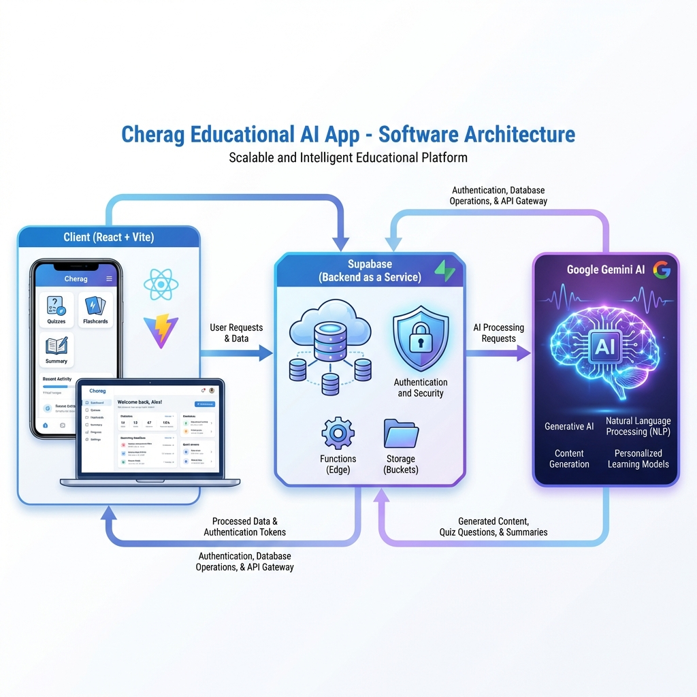

# System Design Document



## Architecture Overview

The Cherag application follows a modern **Client-Server-AI** architecture, leveraging **React** for the frontend, **FastAPI** (deployed on **Railway**) for backend business logic and AI orchestration, **Supabase** as a Backend-as-a-Service (BaaS) for authentication and database, and a multi-provider **AI layer** (Google Gemini as primary, with DeepSeek and OpenRouter as fallbacks).

```mermaid
graph TD
    subgraph Client [Client Side "React + Vite"]
        UI[User Interface]
        Auth[Auth Provider]
        State[State Management]
        
        subgraph Features
            Quiz[Quizzes Tab]
            Flash[Flashcards]
            Sum[Summary]
            Chat[Chat Assistant]
            Mind[Mind Maps]
            Video[Video Intelligence]
        end
        
        UI --> Features
    end

    subgraph FastAPI [Backend "FastAPI on Railway"]
        API[REST API Endpoints]
        AIOrch[AI Orchestration]
        PDFProc[PDF Processor]
    end

    subgraph Backend [Database "Supabase"]
        DB[(PostgreSQL Database)]
        AuthService[Authentication Service]
        Realtime[Realtime Subscriptions]
        Storage[File Storage]
        
        DB --> AuthService
    end

    subgraph AI_Layer [AI Intelligence "Multi-Provider"]
        Gemini[Google Gemini]
        DeepSeek[DeepSeek]
        OpenRouter[OpenRouter]
    end

    %% Data Flow
    Client -- "HTTP/WebSocket" --> Backend
    Client -- "REST API" --> FastAPI
    FastAPI -- "AI Requests" --> AI_Layer
    
    %% Feature Connections
    Quiz -- "Fetch/Save" --> DB
    Quiz -- "Generate Questions" --> API
    Flash -- "Generate Decks" --> API
    Sum -- "Extract Text" --> API
    Video -- "Search Videos" --> API
```

## Core Components

### 1. Frontend Layer
*   **Framework:** React 19 + Vite
*   **Styling:** TailwindCSS 4
*   **Routing:** React Router 7
*   **State Management:** React Hooks (useState, useEffect, Custom Hooks)
*   **Icons:** Lucide React

### 2. Backend Layer

#### FastAPI Service (Railway)
*   **Framework:** FastAPI (Python)
*   **Hosting:** Railway
*   **REST API Endpoints:** PDF upload/processing, quiz/flashcard generation, video search, premium features
*   **AI Orchestration:** Routes requests to AI providers with fallback logic
*   **PDF Processor:** Server-side text extraction using pdfplumber/PyMuPDF

#### Supabase (BaaS)
*   **Database:** PostgreSQL
*   **Authentication:** Supabase Auth (JWT-based)
*   **Tables:**
    *   `quizzes`: Stores generated quizzes and user results.
    *   `activity_history`: Logs all user activities (summaries, quizzes, etc.).
    *   `users`: User profiles.
    *   `flashcards`: Flashcard decks.
*   **Storage:** File storage for uploaded documents
*   **Realtime:** WebSocket subscriptions for live updates

### 3. AI Service Layer (Multi-Provider)
*   **Providers:** Google Gemini (primary), DeepSeek, OpenRouter (fallbacks)
*   **Behavior:** Provider-agnostic functions with automatic fallback on failure
*   **Functions:**
    *   `generateQuizzes`: Creates context-aware questions (works across all providers)
    *   `generateSummary`: Summarizes documents (works across all providers)
    *   `generateFlashcards`: Creates study decks (works across all providers)
*   **Load Balancing:** Key rotation across multiple API keys per provider

## Data Flow (Quiz Generation)
1.  **Input:** User provides a topic or uploads a document (Text/PDF) via the frontend.
2.  **API Request:** Frontend sends the document/topic to FastAPI via REST API.
3.  **Processing:** FastAPI's PDF Processor extracts text server-side (using pdfplumber/PyMuPDF). Client-side tools (`pdfjs`, `mammoth`, `tesseract`) may be used for preview.
4.  **AI Request:** FastAPI's AI Orchestration layer sends the text to the AI Layer (Google Gemini or fallback providers).
5.  **Response:** AI returns JSON array of questions to FastAPI.
6.  **Storage:** FastAPI persists questions to Supabase `quizzes` table.
7.  **Interaction:** User answers questions; results are updated in Supabase via FastAPI.
