# Cherág - System Design Document

## 1. Executive Summary

**Cherág** is an AI-powered study companion that transforms uploaded course materials (PDFs, DOCX, TXT, Markdown) into personalized study aids. The system leverages multiple AI models with automatic fallback, providing students with intelligent flashcards, quizzes, summaries, mind maps, diagrams, and curated video recommendations.

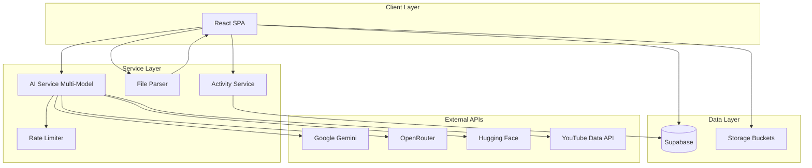

---

## 2. System Architecture

### 2.1 High-Level Architecture

| Component | Technology | Purpose |
|-----------|------------|---------|
| **Frontend** | React 19 + TypeScript + Vite | Single Page Application with modern hooks |
| **Styling** | TailwindCSS 4 + Framer Motion | Responsive UI with smooth animations |
| **Backend** | Supabase (PostgreSQL) | Authentication, Database, Storage |
| **AI Primary** | Google Gemini 2.0/2.5 Flash | Content generation (summaries, flashcards, quizzes) |
| **AI Fallback** | OpenRouter (Molmo) / Hugging Face | Reliability through multi-model fallback |
| **Visualization** | Mermaid.js | Flowcharts and diagrams |

### 2.2 Component Architecture

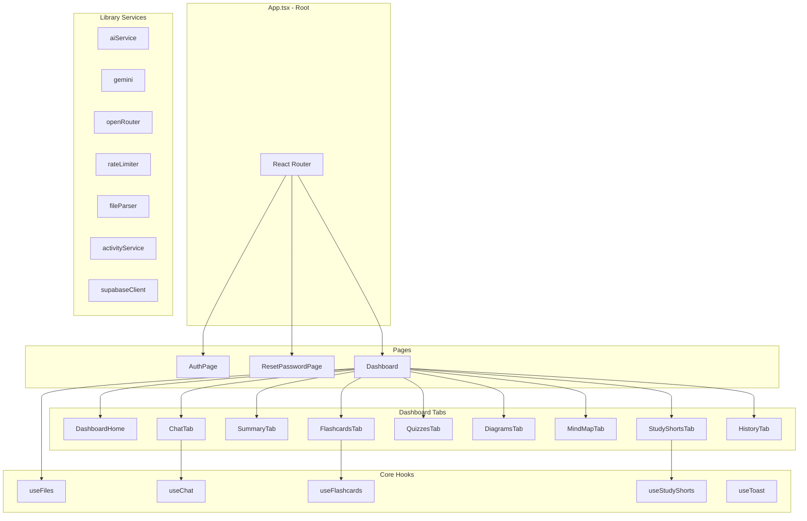

---

## 3. Data Architecture

### 3.1 Database Schema (Supabase PostgreSQL)

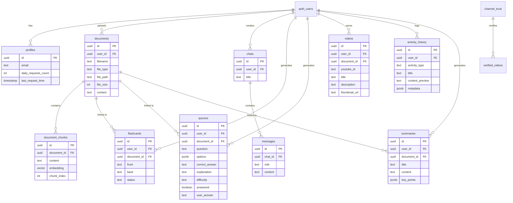

### 3.2 Table Descriptions

| Table | Purpose | Key Fields |
|-------|---------|------------|
| `profiles` | User settings & rate limits | `daily_requests_count`, `last_request_time` |
| `documents` | Uploaded file metadata + full content | `filename`, `content`, `file_type` |
| `document_chunks` | RAG chunks with vector embeddings | `embedding` (vector 768), `chunk_index` |
| `chats` | Chat session containers | `title`, `user_id` |
| `messages` | Chat messages (user/assistant) | `role`, `content` |
| `flashcards` | Generated study flashcards | `front`, `back`, `status` |
| `quizzes` | Multiple choice questions | `options` (JSONB), `correct_answer` |
| `videos` | YouTube video recommendations | `youtube_id`, `thumbnail_url` |
| `activity_history` | User activity log | `activity_type`, `content_preview` |
| `summaries` | Generated document summaries | `content`, `key_points` |
| `channel_trust` | YouTube channel reliability | `trust_score`, `videos_verified` |
| `verified_videos` | Cached verified educational videos | `relevance_score`, `semantic_score` |

### 3.3 Row Level Security (RLS)

All user-facing tables implement RLS policies ensuring users can only access their own data:

```sql
-- Example: Documents table
CREATE POLICY "Users can crud own documents" 
ON documents FOR ALL 
USING (auth.uid() = user_id);
```

---

## 4. AI Service Architecture

### 4.1 Multi-Model Fallback Strategy

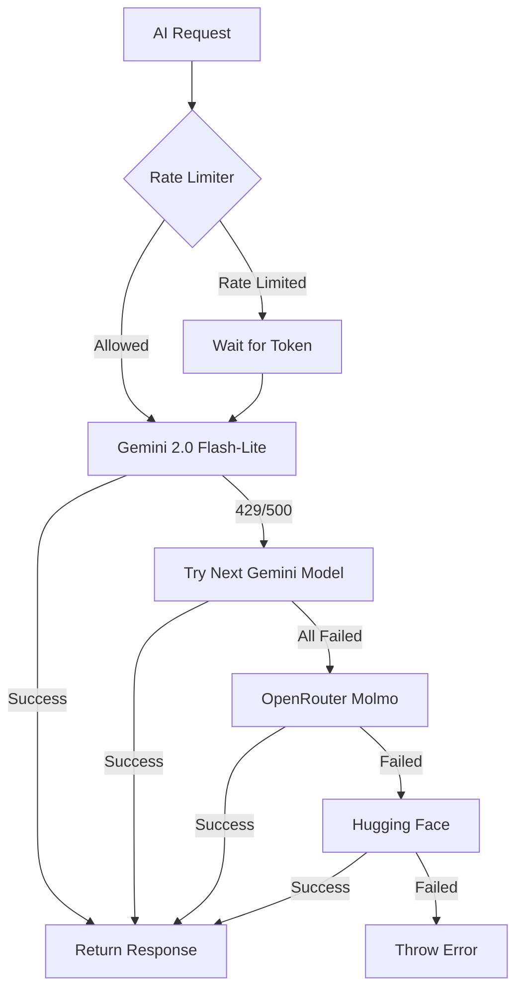

### 4.2 Available AI Models

| Priority | Provider | Model | Use Case |
|----------|----------|-------|----------|
| 1 | Google Gemini | gemini-2.0-flash-lite | Fastest, most efficient |
| 2 | Google Gemini | gemini-2.0-flash | Fast and capable |
| 3 | Google Gemini | gemini-1.5-flash | Reliable fallback |
| 4 | Google Gemini | gemini-1.5-flash-8b | Lightweight |
| 5 | Google Gemini | gemini-2.5-flash | Latest capabilities |
| 6 | OpenRouter | allenai/molmo-2-8b:free | Free alternative for chat |
| 7 | Hugging Face | Various task-specific models | Ultimate fallback |

### 4.3 AI Service Functions

| Function | Input | Output | Purpose |
|----------|-------|--------|---------|
| `generateSummary()` | Document text + options | Markdown summary | Concise document summaries |
| `generateFlashcards()` | Document text | JSON array [{question, answer}] | Study flashcards |
| `generateQuizzes()` | Document text | JSON array [{question, options, correct_answer, explanation}] | MCQ generation |
| `generateDiagram()` | Document text | Mermaid.js code | Flowchart visualization |
| `generateMindMap()` | Document text | JSON tree {title, children[]} | Hierarchical concept map |
| `chatWithAI()` | Context + query | Text response | Context-aware Q&A |
| `generateVideos()` | Topic | Video results + pagination | YouTube recommendations |

### 4.4 Rate Limiting (Token Bucket Algorithm)

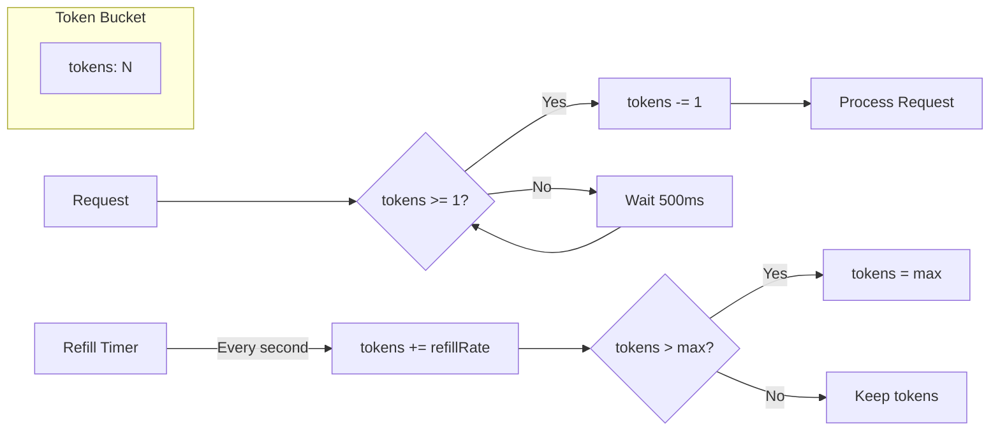

**Rate Limits per Feature:**

| Feature | Max Tokens | Refill Rate |
|---------|------------|-------------|
| Summary | 10/min | 10 tokens/min |
| Flashcards | 8/min | 8 tokens/min |
| Quizzes | 8/min | 8 tokens/min |
| Diagrams | 5/min | 5 tokens/min |
| Mind Maps | 5/min | 5 tokens/min |
| Chat | 15/min | 15 tokens/min |
| Videos | 10/min | 10 tokens/min |

---

## 5. File Processing Pipeline

### 5.1 Supported File Types

| Extension | MIME Type | Parser Used |
|-----------|-----------|-------------|
| `.pdf` | application/pdf | pdfjs-dist |
| `.docx` | application/vnd.openxmlformats-officedocument.wordprocessingml.document | mammoth |
| `.doc` | application/msword | mammoth |
| `.txt` | text/plain | FileReader |
| `.md` | text/markdown | FileReader |

### 5.2 File Upload Flow

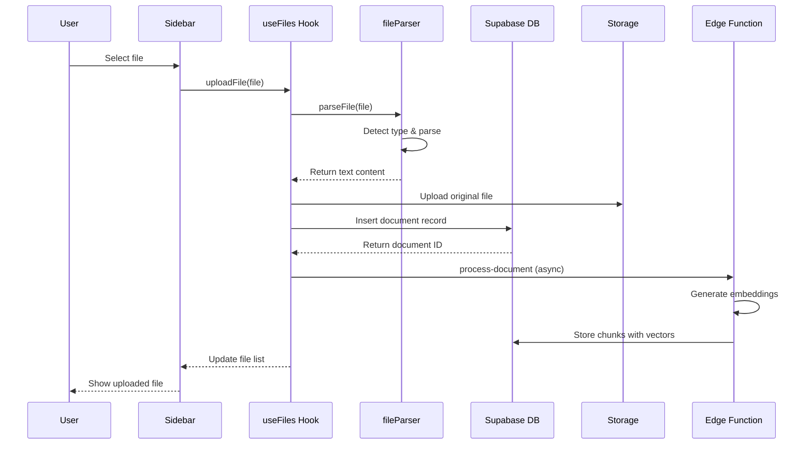

---

## 6. Authentication & Security

### 6.1 Authentication Flow

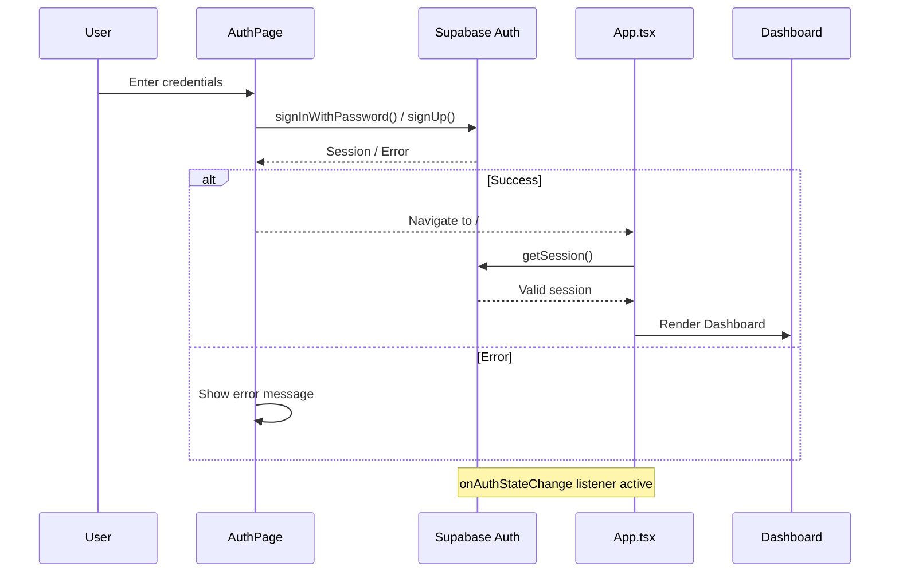

### 6.2 Security Measures

| Layer | Protection |
|-------|------------|
| **Authentication** | Supabase Auth with email verification |
| **Authorization** | Row Level Security (RLS) on all tables |
| **API Keys** | Environment variables (VITE_*) |
| **Input Sanitization** | `sanitizeInput()` in aiService.ts |
| **Rate Limiting** | Client-side token bucket per feature |
| **Storage** | Private buckets with owner-only policies |

---

## 7. Frontend Architecture

### 7.1 Component Hierarchy

```
App.tsx (Router + Auth State)
├── AuthPage.tsx (Login/Signup/Forgot Password)
├── ResetPasswordPage.tsx (Password Reset)
└── Dashboard.tsx (Main Application)
    ├── Sidebar.tsx (Navigation + File Management)
    │   └── Document List
    ├── DashboardHome.tsx (Welcome + Quick Actions)
    ├── ChatTab.tsx (AI Chat Interface)
    ├── SummaryTab.tsx (Document Summaries)
    ├── FlashcardsTab.tsx (Interactive Flashcards)
    ├── QuizzesTab.tsx (MCQ Quiz Interface)
    ├── DiagramsTab.tsx (Mermaid Flowcharts)
    ├── MindMapTab.tsx (Learning Roadmaps)
    ├── StudyShortsTab.tsx (YouTube Videos)
    ├── HistoryTab.tsx (Activity Log)
    ├── SettingsTab.tsx (User Preferences)
    └── ToastContainer.tsx (Notifications)
```

### 7.2 State Management

| Hook | Purpose | State Managed |
|------|---------|---------------|
| `useFiles` | File CRUD operations | `files[]`, `isParsing`, `isLoading` |
| `useChat` | Chat history management | `messages[]`, `isLoading` |
| `useFlashcards` | Flashcard generation & storage | `flashcards[]`, `isLoading` |
| `useStudyShorts` | Video recommendations | `videos[]`, `pageToken` |
| `useToast` | Notification system | `toasts[]` |

### 7.3 Navigation Structure

| Tab ID | Icon | Label | Component |
|--------|------|-------|-----------|
| `dashboard` | LayoutDashboard | Dashboard | DashboardHome |
| `chat` | MessageCircle | Chat | ChatTab |
| `summary` | FileCheck | Summary | SummaryTab |
| `flashcards` | Layers | Flashcards | FlashcardsTab |
| `quizzes` | FileQuestion | Quizzes | QuizzesTab |
| `diagrams` | GitBranch | Diagrams | DiagramsTab |
| `mindmap` | Map | Roadmap | MindMapTab |
| `videos` | Play | Study Shorts | StudyShortsTab |
| `history` | Clock | History | HistoryTab |

---

## 8. Deployment Architecture

### 8.1 Build & Deployment

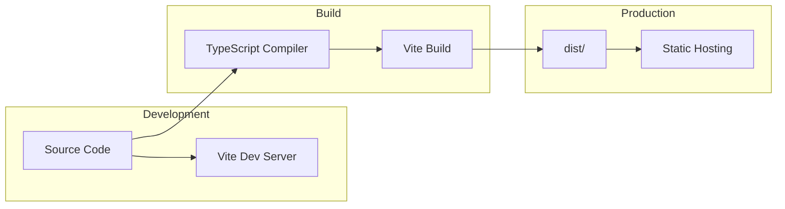

### 8.2 Environment Variables

| Variable | Required | Purpose |
|----------|----------|---------|
| `VITE_SUPABASE_URL` | ✅ | Supabase project URL |
| `VITE_SUPABASE_ANON_KEY` | ✅ | Supabase anonymous key |
| `VITE_GEMINI_API_KEY` | ✅ | Google Gemini API access |
| `VITE_YOUTUBE_API_KEY` | ⚪ | YouTube video recommendations |
| `VITE_OPENROUTER_API_KEY` | ⚪ | OpenRouter fallback |
| `VITE_HUGGINGFACE_API_KEY` | ⚪ | Hugging Face fallback |

---

## 9. Data Flow Diagrams

### 9.1 Document Processing & AI Generation

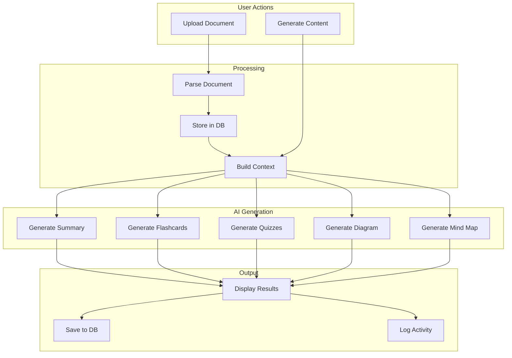

### 9.2 Chat Interaction Flow

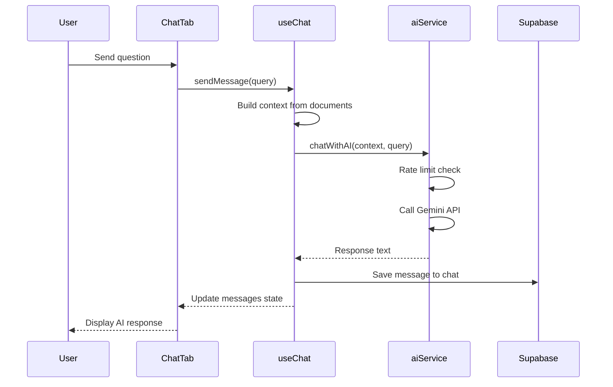

---

## 10. Performance Considerations

### 10.1 Optimization Strategies

| Area | Strategy | Implementation |
|------|----------|----------------|
| **File Parsing** | Client-side processing | pdfjs-dist, mammoth run in browser |
| **API Calls** | Rate limiting | Token bucket prevents quota exhaustion |
| **UI Updates** | Optimistic updates | File list updates before server confirms |
| **State** | Local state | Component-level useState for responsiveness |
| **Theme** | Instant apply | localStorage + CSS class on documentElement |

### 10.2 Caching Strategy

| Data | Cache Location | TTL |
|------|----------------|-----|
| Session | Supabase Auth | Until logout |
| Documents | React state + DB | Persistent |
| Chat history | React state + DB | Persistent |
| Theme preference | localStorage | Persistent |
| Rate limit tokens | Memory (RateLimiter class) | Session |

---

## 11. Error Handling

### 11.1 Error Boundaries

```tsx
// ErrorBoundary.tsx wraps main content
<ErrorBoundary fallback={<ErrorUI />}>
  <Dashboard />
</ErrorBoundary>
```

### 11.2 AI Service Error Handling

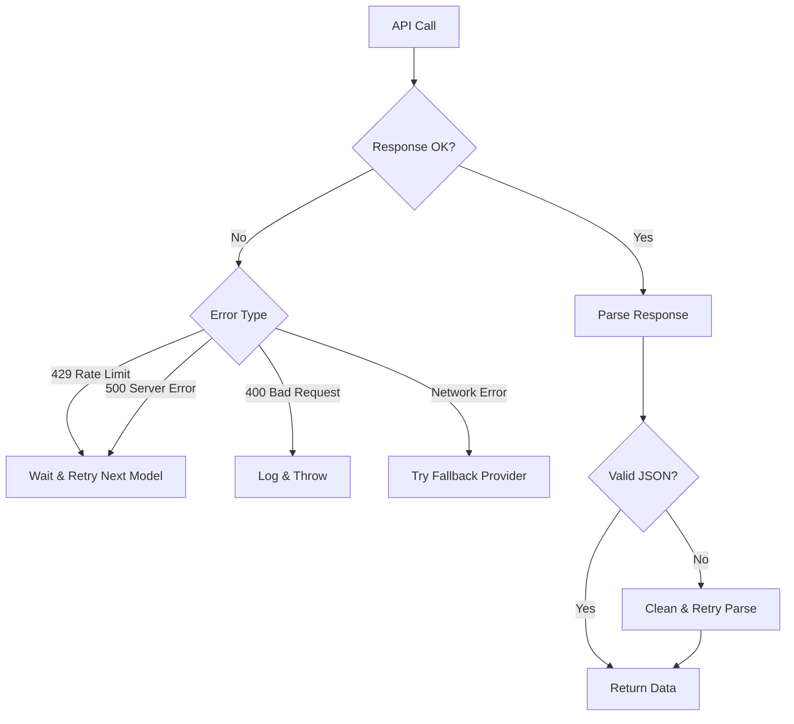

---

## 12. Future Enhancements

### 12.1 Planned Features

1. **RAG Enhancement** - Full vector similarity search using pgvector
2. **Spaced Repetition** - SM-2 algorithm for flashcard scheduling
3. **Collaborative Spaces** - Shared study groups
4. **Export Options** - PDF/Anki deck export
5. **Mobile App** - React Native companion

### 12.2 Scalability Path

| Current | Future |
|---------|--------|
| Client-side AI calls | Edge Functions for security |
| Single user focus | Multi-tenant with quotas |
| Browser storage | CDN for assets |
| Manual file upload | Automatic sync from cloud storage |

---

## 13. Technology Dependencies

### 13.1 Production Dependencies

| Package | Version | Purpose |
|---------|---------|---------|
| react | ^19.2.0 | UI Framework |
| react-dom | ^19.2.0 | DOM Rendering |
| react-router-dom | ^7.10.1 | Client-side routing |
| @supabase/supabase-js | ^2.87.1 | Backend SDK |
| framer-motion | ^12.23.26 | Animations |
| lucide-react | ^0.561.0 | Icons |
| mammoth | ^1.11.0 | DOCX parsing |
| mermaid | ^11.12.2 | Diagram rendering |
| pdfjs-dist | ^5.4.449 | PDF parsing |
| react-markdown | ^10.1.0 | Markdown rendering |

### 13.2 Development Dependencies

| Package | Version | Purpose |
|---------|---------|---------|
| vite | ^5.4.11 | Build tool |
| typescript | ~5.9.3 | Type safety |
| tailwindcss | ^4.1.18 | CSS framework |
| eslint | ^9.39.1 | Code linting |

---

*Document generated on: January 19, 2026*
